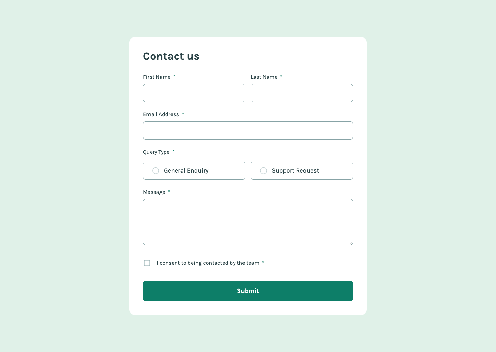
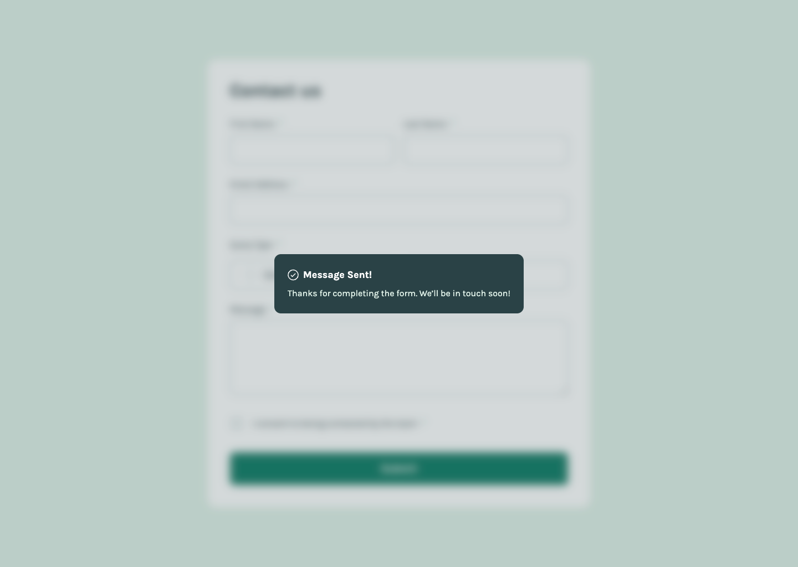

# Contact form solution

## Table of contents

- [Overview](#overview)
   - [The challenge](#the-challenge)
   - [Screenshot](#screenshot)
   - [Installation](#installation)
- [My process](#my-process)
   - [Built with](#built-with)
   - [What I learned](#what-i-learned)
- [Author](#author)

## Overview

### Screenshot




### Installation

1. Clone the repository:
   ```bash
   git clone https://github.com/anamaydev/contact-form.git
   cd contact-form 
   ```
2. Install dependencies:
   ```bash
   npm install
   ```
3. Start the development server:
   ```bash
   npm run dev
   ```

## My process

### Built with

- Semantic HTML5 markup
- CSS custom properties
- Flexbox
- CSS Grid
- Tailwind CSS v4
- Mobile-first workflow
- React JS library

### What I learned

#### Tailwind CSS v4
1. Custom color in Tailwind CSS v4
    ```css
    /* index.css */
    @theme{
      --color-bumbardino: #FFAAAA;
    }
    ```
    ```html
    <h1 class="text-bumbardino">Hello World</h1>
    ```
2. change base styling globally using `@layer base`
   - no need to give class to the h1 and p tag in HTML as it `@layer base` applies globally.
    ```css
    /* index.css */
    @layer base{
      h1{
        @apply text-2xl font-bold;
      }
      
      p{
        @apply color-pink-900 p-2 bg-pink-300;
      }
    }
    ```
    ```html
    <h1>This is a heading</h1>
    <p>This is a paragraph</p>
    ```
3. create frequently used styling for components using `@layer components`
   - lets us create our custom components
   - create custom component in `@layer components` and give the component class name to the element.
    ```css
    /* index.css */
    @layer components{
      .btn{
        @apply @apply p-2 bg-indigo-300 rounded-md font-bold;
      }
    }
    ```
    ```html
    <button class="btn">button</button>
    ```
4. create utility styles using `@layer utility`
   - no need to give class to the h1 and p tag in HTML as it `@layer base` applies globally.
    ```css
    /* index.css */
    @utility flex-center{
      @apply flex justify-center items-center;
    }
    ```
    ```html
    <div class="flex-center h-100 w-100 mx-auto">
      <div class="h-4 w-4 bg-pink-400"></div>
    </div>
    ```
5. using `@font-face` to import font
   - use `@font-face` before `@import "tailwindcss"`
   ```css
   @font-face {
      font-family: "Karla";
      src: url("./assets/fonts/Karla-VariableFont_wght.ttf") format("truetype");
      font-weight: 100 900;
      font-style: normal;
      font-display: swap;
   }

   @import "tailwindcss";

   @theme{
      --font-karla: "Karla", sans-serif;
   }
   ```
   ```html
   <p class="text-2xl font-karla font-black">This is a karla font</p>
   ```

6. custom spacing
   1. create custom spacing variables
      ```css
      @theme{
        --spacing-100: 0.5rem;
        --spacing-200: 1rem;
        --spacing-300: 1.5rem;
        --spacing-400: 2rem;
      }
      ```
      ```html
      <div class="flex gap-(--spacing-400) | gap-[var(--spacing-200)] "></div>
      ```
   2. customize existing default tailwind spacing
      - it will set the base spacing to 0.5rem instead of 0.25rem and dynamically calculate the values
      ```css
      @theme{
        --spacing: 0.5rem;
      }
      ```
      ```html
      <div class="flex gap-4"></div>
      ```
      
#### &lt; fieldset &gt; and it's bug
- `<button>` / `<fieldset>` do not work same as `<div>`
- [reference](https://stackoverflow.com/questions/28078681/why-cant-fieldset-be-flex-containers)
- old code
   ```jsx
   {/* query type */}
   <fieldset className="flex flex-col justify-center gap-2">
     <legend className="label">Query Type</legend>
     <ul className="flex flex-col justify-center gap-2"> {/*remove gap-2*/}
       <li className="input-field flex gap-1.5">
         
         
         <p>General Enquiry</p>
       </li>
       <li className="input-field">Support Request</li>
     </ul>
   </fieldset> {/* query type */}
   ```
   - In the above code the display: flex to fieldset is not working as expected
- walkaround
   ```jsx
   {/* fake fieldset */}
   <div role="group" className="flex flex-col justify-center gap-2" aria-labelledby="query-legend">
     {/* fake legend */}
     <p className="label" id="query-legend">Query Type</p>

     <ul className="flex flex-col justify-center gap-2"> {/*remove gap-2*/}
       <li className="input-field flex gap-1.5">
         
         
         <p>General Enquiry</p>
       </li>
       <li className="input-field">Support Request</li>
     </ul>
   </div>
   ```

## Author

- @anamaydev - [https://github.com/anamaydev](https://github.com/anamaydev)